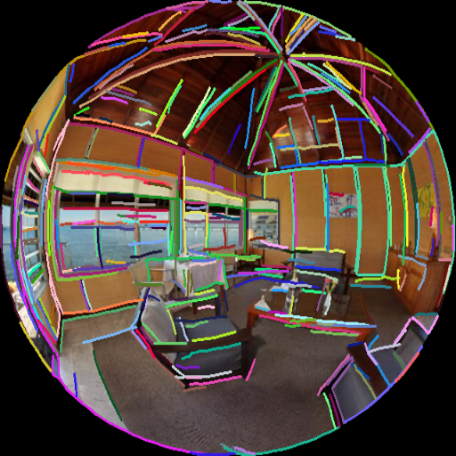
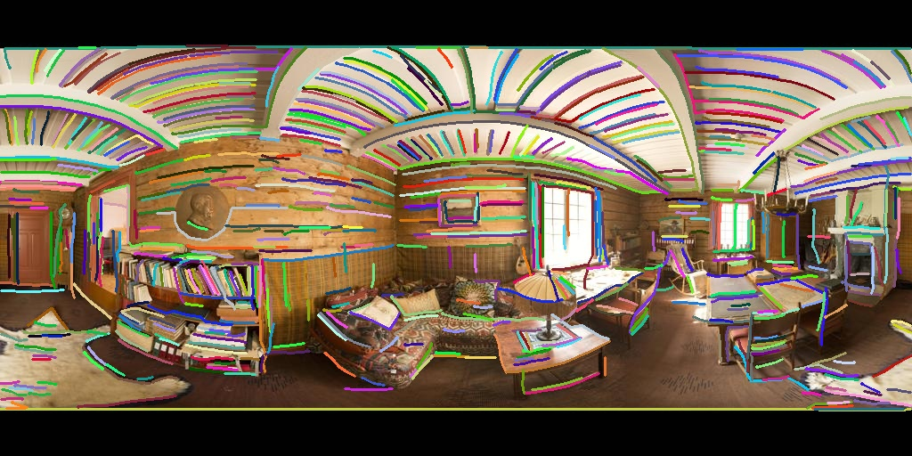

# UFO-CSD: Ultra-wide Field-of-view distorted camera light-Object Curve Segment Drawing


## What It Solves

UFO-CSD rapidly extracts **complete, reliable curves from heavily distorted fisheye and panoramic images**—without undistortion and without loss of edge detail.

## Why It’s Different

* **Undistortion‑free, spherical processing** – operates directly on the equivalent spherical surface of raw distorted frames, preserving every pixel and all peripheral detail.

* **Omnidirectional growth in milliseconds** – gradient‑ and distance‑constrained exploration rapidly sketches curve skeletons across the full FoV.

* **Integrity verification & global stitching** – geometric checks reunite consistent segments and suppress outliers, delivering complete, reliable curves.

* **Real‑time on edge devices** – up to 10 × faster with higher detection rate and lower localization error than state‑of‑the‑art, even without a dedicated GPU.

## Visualizations
<table border="0" cellspacing="0" cellpadding="0" style="border:none;">
  <tr>
    <td style="border:none;">
      
    </td>
    <td style="border:none;">
      
    </td>
  </tr>
  <tr>
    <td colspan="2" align="center" style="border:none;">
      
    </td>
  </tr>
</table>

## Coming Soon
Upon acceptance, we will open-source the code, dataset, and usage guide.

```bibtex
@article{zhang2025ufocsd,
  title   = {UFO-CSD: Ultra-wide Field-of-view distorted camera light-Object Curve Segment Drawing},
  author  = {Zhixiong Zhang and et al.},
  journal = {Pattern Recognition},
  year    = {2025},
  note    = {Under review}
}
```
